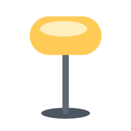

<p align="center">
  
</p>

<h1 align="center">Google dLight for Home Assistant</h1>

<p align="center">
  Native Home Assistant integration for the Google <strong>dLight</strong> experimental desk lamp.<br>
  Control power, brightness and color temperature <strong>locally</strong>, over the lamp's own TCP protocol —
  no MQTT bridge, no extra container.
</p>

<p align="center">
  <a href="https://my.home-assistant.io/redirect/hacs_repository/?owner=thekoma&repository=dlight-homeassistant&category=integration"></a>
</p>

<p align="center">
  <a href="https://github.com/hacs/integration"></a>
  <a href="https://github.com/thekoma/dlight-homeassistant/actions/workflows/validate.yml"></a>
  <a href="https://github.com/thekoma/dlight-homeassistant/actions/workflows/test.yml"></a>
  <a href="https://github.com/thekoma/dlight-homeassistant/releases/latest"></a>
  <a href="LICENSE"></a>
</p>

---

## Overview

The **Google dLight** is an experimental smart desk lamp that speaks a local
TCP/JSON protocol on your LAN. By reverse-engineering a lamp I own, this
integration talks to it **directly from Home Assistant** — the lamp shows up as a
normal `light` entity with on/off, brightness and color temperature, discovered
automatically over mDNS.

There is no cloud, no MQTT broker and no side-car container to run or babysit:
the protocol client lives inside the integration and runs in Home Assistant's
event loop.

## Features

- **Local & cloud-free** — direct TCP control on your LAN, nothing leaves the network.
- **Zeroconf auto-discovery** — the lamp is found automatically via mDNS (`_ged7._tcp`); manual setup (IP + device ID) is available as a fallback.
- **Full light control** — power, brightness, and color temperature (**2600 K – 6000 K**).
- **Reflects physical changes** — adjustments made on the lamp's touch ring are picked up by polling.
- **Gentle on the hardware** — all I/O is serialized and polling is conservative (default 30 s, configurable), because the lamp only sustains a single connection at a time.
- **Optimistic updates** — commands feel instant in the UI without hammering the lamp with extra polls.
- **HACS-ready** — one-click install, bundled brand icon, CI-validated (hassfest + HACS).
- **Localized** — translated into 29 languages, covering the countries where Google has offices.

## Supported device

| | |
|---|---|
| **Product** | Google dLight (experimental desk lamp) |
| **Model** | `GLAMP001` |
| **Tested firmware** | `3.0.4` |
| **Transport** | TCP port `3333` (local) |
| **Discovery** | mDNS service `_ged7._tcp.local.`, instance `GLAMP_<deviceId>` |
| **Color temperature** | 2600 K (warmest) – 6000 K (coolest) |
| **Brightness** | 1–100 on the device, mapped to Home Assistant's 1–255 |

## How it works

```
        mDNS  _ged7._tcp                         TCP :3333  (JSON, length-prefixed)
Home Assistant ───────────────►  custom_components/dlight  ───────────────────────►  dLight lamp
  light entity ◄───────────────  client + coordinator      ◄───────────────────────  (GLAMP001)
                 discovery / state            (single serialized connection)
```

- **`client.py`** — a dependency-free async TCP client implementing the lamp protocol. A per-lamp `asyncio.Lock` guarantees only one connection is open at a time.
- **`coordinator.py`** — a `DataUpdateCoordinator` that polls the lamp's state on a configurable interval and exposes it to the entity.
- **`light.py`** — the `light` entity: maps the lamp's state to Home Assistant and translates service calls into commands, with optimistic state updates.
- **`config_flow.py`** — zeroconf discovery + manual setup, plus an options flow for the poll interval.

## Requirements

- **Home Assistant 2024.12** or newer. (The bundled brand icon is served automatically on **2026.3+** via the brands proxy; on older versions the integration still works, just with the default icon.)
- The lamp powered on and reachable from your Home Assistant host (same LAN / mDNS reachable, TCP `3333` open).

## Installation

### HACS (recommended)

[](https://my.home-assistant.io/redirect/hacs_repository/?owner=thekoma&repository=dlight-homeassistant&category=integration)

1. Click the badge above (or in HACS: **⋮ → Custom repositories**, add
   `https://github.com/thekoma/dlight-homeassistant`, category **Integration**).
2. Install **Google dLight**.
3. **Restart** Home Assistant.

### Manual

1. Copy `custom_components/dlight/` into your Home Assistant `config/custom_components/` directory.
2. Restart Home Assistant.

## Configuration

No YAML required — everything is done from the UI.

### Automatic discovery

When the lamp is on the network, Home Assistant discovers it and shows a
notification under **Settings → Devices & Services**. Click **Configure** and
confirm.

### Manual setup

If discovery doesn't find it (e.g. different VLAN / mDNS blocked):

1. **Settings → Devices & Services → Add Integration → Google dLight**.
2. Enter the lamp's **host/IP** and its **device ID** (the `<deviceId>` part of
   its `GLAMP_<deviceId>` mDNS name).

### Options

Open the integration's **Configure** dialog to set the **polling interval**
(seconds, default `30`, minimum `5`). Increase it if you want to be extra gentle
on the lamp; decrease it for snappier reflection of physical-control changes.

## What you get

A single `light` entity (and a matching device) exposing:

| Capability | Details |
|---|---|
| Power | `on` / `off` |
| Brightness | full range, mapped from the lamp's 1–100 scale |
| Color temperature | `color_temp` mode, **2600–6000 K** |
| Availability | entity goes `unavailable` if the lamp can't be reached, and recovers automatically |

The device page shows the model (`GLAMP001`), firmware/hardware versions and the
lamp's MAC address.

## Design notes

A few things make this integration reliable with the dLight:

1. **In-process, no side-car.** The protocol client runs inside Home Assistant —
   there's no separate service or container to deploy and monitor.
2. **Gentle on the hardware.** Reverse-engineering the device showed it accepts
   **one connection at a time**, and a single state query takes **~1.2 s** on
   current firmware. Polling it too aggressively makes it unstable, so this
   integration polls conservatively (30 s by default), serializes every request
   behind one lock, and uses optimistic updates so the UI stays responsive
   without extra round-trips.
3. **Correct color-temperature range.** Verified on-device: the lamp spans
   **2600–6000 K**.

## Under the hood

The lamp speaks a small TCP/JSON protocol on port `3333`: the client sends a
compact JSON command terminated by a newline, and the lamp replies with a 4-byte
big-endian length prefix followed by a JSON body. It advertises itself over mDNS
as `_ged7._tcp.local.` with the instance name `GLAMP_<deviceId>` and a TXT record
carrying its MAC, model and firmware. All of this was worked out by
reverse-engineering the device.

## Troubleshooting

- **Lamp not discovered** — add it manually (host + device ID). Make sure Home
  Assistant and the lamp share a subnet or that mDNS is forwarded between VLANs.
- **Entity `unavailable`** — check the lamp's IP (DHCP may have reassigned it;
  re-discovery updates the stored host) and that TCP `3333` is reachable. Note
  the lamp may answer ICMP slowly/variably — use a port check rather than ping.
- **Occasional instability** — raise the polling interval in **Options**.
- **Default (puzzle-piece) icon** — the bundled icon is served via the HA 2026.3+
  brands proxy; on older Home Assistant versions the default icon is shown.

## Development

```bash
git clone https://github.com/thekoma/dlight-homeassistant
cd dlight-homeassistant
python -m venv .venv && source .venv/bin/activate
pip install -r requirements_test.txt
pytest                 # 25 tests (client / coordinator / light / config flow)
```

CI runs `pytest`, Home Assistant **hassfest**, and **HACS** validation on every
push.

### Project layout

```
custom_components/dlight/
├── __init__.py        # config entry setup/unload
├── manifest.json
├── const.py
├── client.py          # async TCP protocol client (no external deps)
├── coordinator.py     # DataUpdateCoordinator (polling)
├── light.py           # the light entity
├── config_flow.py     # zeroconf + manual setup + options
├── strings.json / translations/
└── brand/             # icon.png, icon@2x.png (served via the brands proxy)
icons/                 # icon.svg (gradient) + icon-stylized.svg (flat) sources
tests/                 # pytest-homeassistant-custom-component suite
```

## License

Released under the [MIT License](LICENSE).
